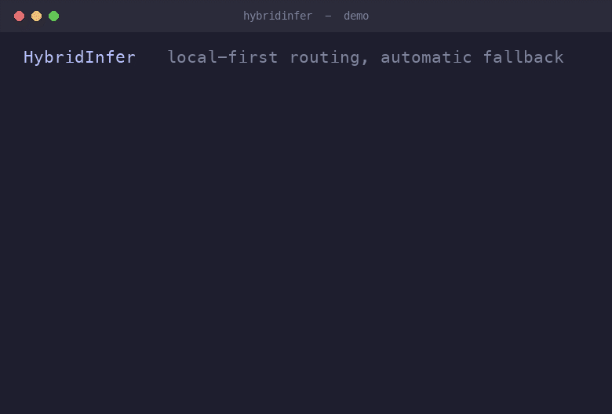

# HybridInfer

**Run LLMs on your own machine, without the crashes.** HybridInfer is a
reliability-aware router: it sends each request to your **local** model first,
watches the local runtime in real time, and the moment local inference stalls,
crashes, or is *predicted* to fail, it transparently falls back to a **remote**
model. You keep local-first speed and privacy; you never get left with a wedged
model and no answer.



It runs as a local **OpenAI-compatible server**, so any tool that can talk to
the OpenAI API can point at HybridInfer and get smart routing for free.

> The routing and reliability core is a Python port of the failure-aware
> runtime-health controller from the HybridInfer research system
> (https://github.com/SimranKoul2026/HybridInfer).

## Why

Running a model locally is cheap and private, but local runtimes wedge: long
prompts stall in prefill, the GPU runs out of memory, a driver hangs. Naive
"local only" setups then just hang. HybridInfer treats reliability as a
first-class routing signal:

- **Local-first.** Cheap/short requests stay on your device.
- **Runtime-health aware.** It learns, per model and per prompt length, how
  likely local is to fail, and pre-empts the requests that would.
- **In-request fallback.** If local stalls (no token for N seconds) or errors
  mid-request, it retries on the remote tier automatically - the caller just
  gets an answer.
- **Self-healing.** A model that keeps failing is pulled out of rotation, then
  probed back in after a cooldown.
- **Your models, your choice.** Local tier is any model you've pulled in
  [Ollama](https://ollama.com); remote tier is any OpenAI-compatible endpoint.

## Install

```bash
pip install hybridinfer
```

You also need [Ollama](https://ollama.com) for the local tier:

```bash
ollama pull llama3.2:3b
```

## Quickstart

```bash
# 1. write a starter config to ~/.hybridinfer/config.yaml
hybridinfer init

# 2. point the remote tier at your provider
export OPENAI_API_KEY=sk-...

# 3a. one-shot from the CLI
hybridinfer run "Explain the CAP theorem in two sentences."

# 3b. or run the server and use it like the OpenAI API
hybridinfer serve
```

```bash
curl http://127.0.0.1:8080/v1/chat/completions \
  -H 'Content-Type: application/json' \
  -d '{"messages":[{"role":"user","content":"Write a haiku about GPUs."}]}'
```

Point any OpenAI client at it - streaming works too:

```python
from openai import OpenAI
client = OpenAI(base_url="http://127.0.0.1:8080/v1", api_key="unused")

# non-streaming
r = client.chat.completions.create(model="auto", messages=[{"role": "user", "content": "hi"}])
print(r.choices[0].message.content)

# streaming (Server-Sent Events)
for chunk in client.chat.completions.create(
    model="auto", messages=[{"role": "user", "content": "hi"}], stream=True
):
    print(chunk.choices[0].delta.content or "", end="", flush=True)
```

Or from the CLI: `hybridinfer run --stream "..."`.

Every response carries a non-standard `hybridinfer` block telling you which tier
served it, whether it fell back, and the latency - safe for clients to ignore.
In streaming mode this metadata rides on the final chunk (the one with
`finish_reason: "stop"`), just before `data: [DONE]`.

### Streaming and fallback: first-token commit

Streaming complicates fallback - once a token is on the wire it cannot be
un-sent. HybridInfer handles this with **first-token-commit** semantics:

- If local fails **before** emitting a token (the dominant prefill-wedge case),
  it falls back to remote cleanly - the client only ever sees the remote stream.
- Once local has emitted a token, the request is **committed** to local; a
  mid-stream wedge ends the stream honestly (the final chunk reports the error)
  rather than garbling output by splicing in a second model.

## Use it as a library

```python
from hybridinfer.config import load_settings
from hybridinfer.router import HybridRouter

router = HybridRouter(load_settings("~/.hybridinfer/config.yaml"))
res = router.complete([{"role": "user", "content": "hello"}])
print(res.text, res.tier, res.fell_back)
```

## How routing works

For each request:

1. **Estimate complexity** (prompt length -> short / medium / long bin).
2. **Predict local failure risk** from a self-calibrating profile keyed by
   `(backend, model, length-bin)`. If it is above `risk_prefer_remote`, skip
   local and go straight to remote.
3. **Try local** under a hard timeout **and** a stall watchdog (no new token for
   `local_stall_timeout_s` => treated as a wedge).
4. **On any local failure, fall back to remote** in the same request.
5. **Record the outcome** to update the risk profile and a safety state machine
   (`LOCAL_ELIGIBLE -> CAUTION -> UNSAFE -> RECOVERING -> RESTORED`) that pulls a
   failing local tier out and probes it back after a cooldown that **grows
   exponentially** on repeated failures (60s -> 120s -> 240s..., capped).

Every response carries a structured **routing `reason`** in the `hybridinfer`
metadata (e.g. `local_ok`, `fell_back:stall`, `risk_gate`, `local_held_out`,
`no_fallback_unsafe:...`), so you can see exactly why a request went where it
did. Failure classes are distinct too: **`prefill_timeout`** (the first token
never arrived) vs **`stall`** (tokens stopped mid-stream) vs `oom` /
`connection` / `server_error`.

## Idempotency (don't duplicate side effects)

By default a chat request is treated as read-only and safe to retry, so fallback
is free. For **side-effecting / tool-calling** requests a blind retry could
duplicate an effect, so you can opt out per request:

- **`Idempotency-Key: <key>`** - marks the request safe to retry (the key lets
  you dedupe downstream); fallback stays enabled.
- **`X-HybridInfer-Safe-To-Retry: false`** - marks a mutating request; with no
  idempotency key, HybridInfer **commits to a single tier and will not fall
  back**, surfacing the failure (`reason: no_fallback_unsafe:...`) instead of
  replaying it.

(Both can also be set in the request body under a `hybridinfer` object; library
callers pass `router.complete(..., safe_to_retry=False, idempotency_key="...")`.)

## Not tied to Ollama

Ollama is the convenient default, but any tier can be **any OpenAI-compatible
server**. Point the **local** tier at a llama.cpp / vLLM / LM Studio server on
localhost with `backend: openai` and a `base_url`; the **remote** tier can
likewise be another self-hosted box, not just a cloud API.

## Configuration

`hybridinfer init` writes an annotated `config.yaml`. Key knobs:

| Key | Meaning |
|---|---|
| `local` / `remote` | backend (`ollama` / `openai`), model, base_url, api_key_env |
| `routing.local_stall_timeout_s` | no-token gap that counts as a wedge |
| `routing.risk_prefer_remote` | predicted-failure prob at/above which local is skipped |
| `routing.enable_in_request_fallback` | auto-retry on remote when local fails |
| `routing.enable_recovery` | hold out a failing local tier, then probe it back |
| `routing.recovery_cooldown_s` / `recovery_backoff` / `recovery_cooldown_max_s` | probe cooldown + exponential backoff + cap |
| `risk_profile_path` | where the learned risk profile is persisted |

The `force_local` / `force_remote` flags and the `enable_*` gates also let you
reproduce the research A0-A3 reliability ablation arms.

## Scope / honesty

- This is a **router**, not an inference engine - it orchestrates Ollama and a
  remote API, it does not run model weights itself.
- The desktop build uses **runtime-health** signals (latency, stalls, errors,
  learned risk). The Android research additionally used on-device **thermal**
  headroom, which has no portable desktop equivalent.
- Streaming (SSE) is supported with first-token-commit fallback (above). A
  mid-stream local wedge after the first token cannot be recovered by fallback.

## License

Apache-2.0. See [LICENSE](LICENSE).
